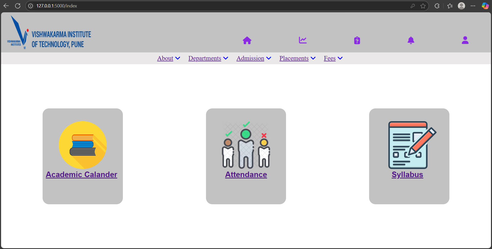
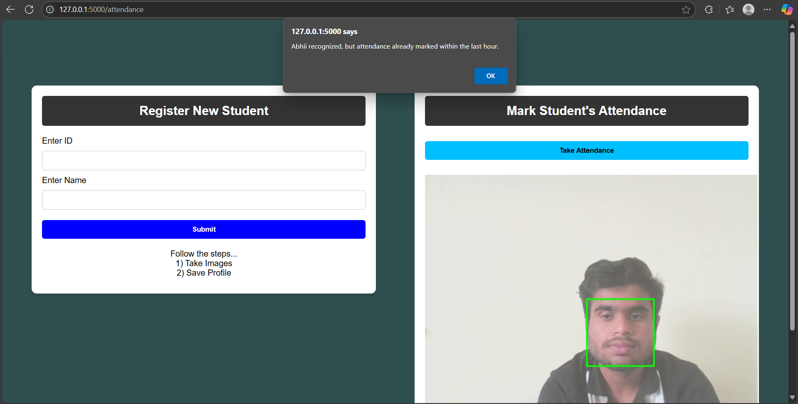

# 🧠 Smart Attendance Management System using Face Recognition

A Flask-based web application to automate student attendance using real-time face recognition via webcam. It securely captures attendance, prevents duplicate entries, and stores records in both Excel and SQLite database formats.

---

## 🚀 Key Features

- 🎥 Live webcam feed with face detection & recognition
- 👤 Student registration with image capture
- 📝 Attendance auto-marked with Excel export
- 🔒 Secure login for admin access
- 📅 Duplicate attendance prevention within the same hour
- 📊 SQLite database integration

---

## ⚙ How It Works

1. *Register* students by capturing their face via webcam.
2. Start the *live camera feed*.
3. When a known face appears, the system:
   - Matches it with registered data from images folder
   - Marks attendance in Attendance.xlsx
   - Logs it in the attendance.db database
   - Skips duplicate entry if already marked in the past hour
4. Admin can *view/manage attendance* via the Flask web interface.

---

## 🛠 Tech Stack

- *Frontend*: HTML, CSS, Bootstrap (Jinja2 Templates)
- *Backend*: Python, Flask
- *Recognition*: OpenCV, face_recognition
- *Database*: SQLite3
- *Export*: Excel via pandas

---

## 📂 Project Structure

.vscode/python/
├── app.py               # Main Flask app
├── captured_images/     # Registered face images
├── instance/            # Contains attendance.db
├── static/, templates/  # CSS/JS and HTML
├── Attendance.xlsx      # Auto-generated Excel log
├── screenshots/         # For README visuals

---

## 🖼 Screenshots

| Login | Dashboard | Webcam |
|-------|-----------|--------|
|  |  |  |

---

## ▶ Getting Started

### 1. Clone & Navigate
bash
git clone https://github.com/passionate-coder26/Smart-Attendance-System-using-face-recognition.git
cd Smart-Attendance-System-using-face-recognition/.vscode/python

### 2. Install Requirements
bash
pip install -r requirements.txt

### 3. Launch the App
bash
python app.py

Visit [http://127.0.0.1:5000](http://127.0.0.1:5000) to start using the app.

---

## 📦 Requirements

flask
opencv-python
face_recognition
pandas
werkzeug

---

## 🔗 Useful Links

- 🎬 [Demo Video](https://www.linkedin.com/posts/abhiramnair436_smart-attendance-management-system-using-activity-7353654300717297664-iXvJ?utm_source=share&utm_medium=member_desktop&rcm=ACoAAFLgeYMBS9yP5czdEZrjxLI-rCCOw0ei8Sg)
- 📸 [Screenshots Folder](screenshots/)
- 📘 [face_recognition Library](https://github.com/ageitgey/face_recognition)
-  💻 [GitHub Repository](https://github.com/passionate-coder26/Smart-Attendance-System-using-face-recognition)  
  Access the full source code and documentation.

---

## 🙌 About

Developed by *Abhiram Muraleedharan Nair* as a practical solution for secure, efficient, and tech-driven attendance management in educational settings.

---

## 📃 License

This project is licensed under the MIT License.
